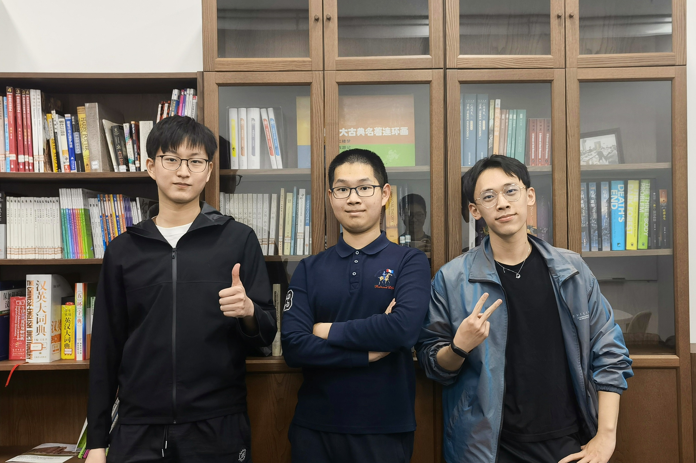
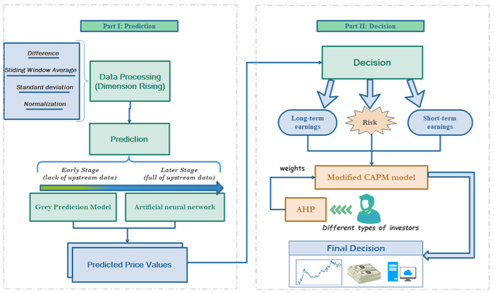
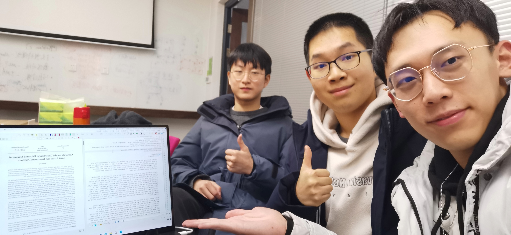
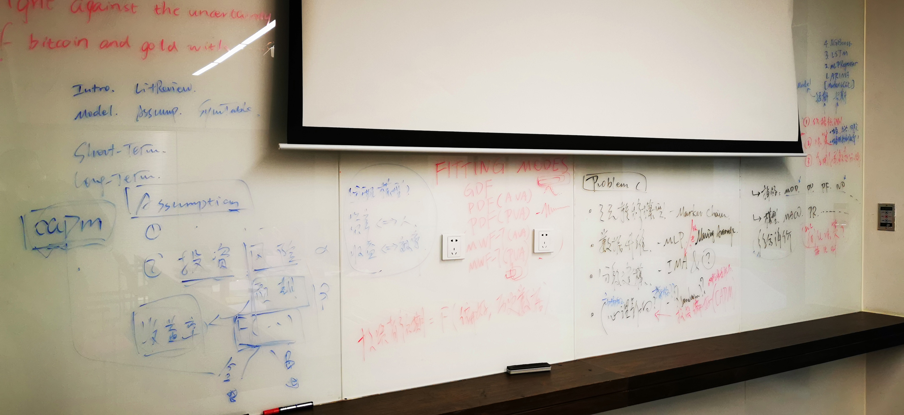

# 2022年美国数学建模竞赛 - Team 2214713

## **成员**

ZJUI 2020级电子与计算机工程 **陈梓源** CHEN Ziyuan

ZJUI 2020级电子与计算机工程 **陈志榕** CHEN Zhirong

ZJUI 2020级电子与计算机工程 **马梓诚** MA Zicheng

 

## **解题思路的亮点**

我们这次建模竞赛选的是C题，也就是大数据建模。选题大约花了半天时间，其实寒假在学习准备的时候心里就已经有了预设，三名队员都自我感觉最擅长数据分析处理，其次是离散数学建模（A题），最后才是连续数学建模（B题）。工科生的学习方向与数学专业有较大不同，比起进行严谨的算式推导，我们更擅长利用大一学习的Python语言及其预置的算法包进行数据分析。

我们论文写作的总体思路是注重模型的丰富、特征考虑的周全，围绕“预测”与“决策”两大部分展开：
- **在预测中区分短期与长期两种目标**，综合使用ARIMA（时间序列分析）、GM（灰色预测）、MLP（多层感知机）、SVM（支持向量机）等多种模型，并辅以数据升维以提取更普适的全局特征；
- 在决策中使用CAPM（资本资产定价模型）与LinProg（线性规划），考虑黄金的休市日设计了备用模型，**并充分考虑社会实际，创新性引入了投资者偏好（注重短期/长期收益、偏向稳定/风险）的表征**，利用AHP（层次分析法）确定超参数；
- 我们的决策模型获得了最高$38,820（37.8倍增长）的可观收益，虽然超参数等细节使最终收益并非最优，但模型却具有较强的灵活性。

### ***Takeaway Points***

- 论文结构清晰：预测（小数据、大数据；短期、长期）+决策（双变量、单变量）
- 模型种类丰富：GM、MLP、CAPM、LinProg、AHP……
- 图表表意高效：散点图（相关性）、折线图（价格波动）、曲面图（多变量灵敏度分析）……
- 细节考虑周全：训练样本来源（所有历史数据 vs. 移动窗口）、黄金休市日……
- 应用部署灵活：适应各种投资者偏好（眼光、风险承受能力）【**创新点**！过往的论文中并没有很多研究】

 

## **团队攻坚的经历**

比赛前的寒假，团队进行了为期一个月的准备。队员们研读《Python数学实验与建模》以熟悉各种模型，每四天开一次线上会议探讨困惑，到寒假结束时，队员们基本学会并用Python**实现了美赛中常见的模型**，陈梓源还将课本中提及的12大类、63个模型包装成易于调用的[接口](resources/python_math_modelling_api.py)。同时，我们还**学习了LaTex的使用方法**，对写作部分的技巧和细节进行了一定程度的学习。比赛开始前夕，团队还专门开了个小会，确定好美赛四天的时间分配和各人负责的模块，我们相信充分的准备和明确的分工是美赛取得佳绩的关键。

这道题目的主要任务是“根据黄金和比特币过去五年的价格给出最佳交易策略”。今年的C题与往年有一个很大的不同，那就是数据量大大减少：往年会给数万条不同形式的数据，这次只给了总计三千条相对单一的数据（两种资产的五年历史价格），而且题目不允许参考外部数据，也就是说**手头的信息变少了**。**如何挖掘数据背后的信息**成为了能否脱颖而出的关键。我们小组对于数据特征的提取下了一番功夫，设置了非常多的不同指标，同时利用“滑窗”对特征信息进行不同时间段长度的提取和筛选、

在选题时我们充分权衡了难度：小数据处理的难度**看起来**更小，选择C题的队伍会更多（结果证明确是如此，全世界27,205支参赛队伍中有36.92%选择了此题），竞争会更加激烈（相比于2.514%的F奖总体获奖率，C题的F奖获奖率仅有1.852%），但这也同时意味着数据挖掘的难度将会成倍增大，需要花更多时间设计特征、升维数据、调整评价指标……

随着比赛的进行，问题中隐含的难关也逐个浮出水面：如何根据前后期不同的数据量进行价格预测，模型怎样区分？如何量化投资风险，在考虑用户偏好的前提下获得最大收益？种种现实考量，均需斟酌思考，而队员们在四天里也都竭尽全力、各司其职，保质保量地将难题逐一攻克。

### ***Takeaway Points***

- 每名队员都以“80%A+10%B+10%C”的比重负责建模、代码、写作三大模块，也即每人以某一模块为主，兼顾其他两个模块：
    - 陈志榕集中精力设计复杂的CAPM模型、调整超参数；
    - 马梓诚专攻线性规划模型、投资者偏好决策、灵敏度分析、代码调试；
    - 陈梓源则主管预测算法、数据可视化、以及论文撰写与排版。
- 队友遇到困难时，我们彼此帮助、共同解决，
    - 既保证了相对明确的分工，尽量发挥队员的长处，
    - 又可以确保团队能够及时高效、从容不迫地化解困难。

 

## **指导教师的帮助**

指导老师Thomas Honold教授在赛前为我们小组寻找了一些学习数学建模的资源，包括两本英文书籍，相比于我们自己购买的书籍更加贴近比赛应用层面；还有另一个建模比赛资源网站，其中有许多关于英文数学建模的资料与过往试题。

更重要的是，教授对我们的帮助从大二上学期接触他的微分方程课程便已开始。Thomas Honold教授是一位非常具有数学思维的老师，他的课程对我们数学能力的提升帮助甚大。

 

## **队员们的备赛建议**

- 常用Python Module
    - 数据处理：[`numpy`](https://numpy.org/doc/stable/user/index.html)，[`pandas`](https://pandas.pydata.org/docs/user_guide/index.html)，[`statsmodels`](https://www.statsmodels.org/stable/user-guide.html)
    - 模型建构：[`scipy`](https://scipy.github.io/devdocs/tutorial/index.html)，[`sympy`](https://docs.sympy.org/latest/tutorial/index.html)
    - 机器学习：[`sklearn`](https://scikit-learn.org/stable/user_guide.html)（开箱即用），[`pytorch`](https://pytorch.org/docs/stable/index.html)（功能更复杂）
    - 数据可视化：[`matplotlib`](https://matplotlib.org/stable/users/index.html)，[`seaborn`](https://seaborn.pydata.org/api.html)
- 常用软件
    - 数据处理：[SPSSPRO](https://www.spsspro.com/client)
    - 模型建构：[MATLAB](https://www.mathworks.com/downloads/matlab)
    - 论文写作：[TeX Live](https://mirror.ctan.org/systems/texlive/tlnet/install-tl-windows.exe)，[TeXStudio](https://sourceforge.net/projects/texstudio/files/latest/download)
- 赛前一定要充分准备，学习常用的数学模型，如果有意向选择C题，也要熟悉常见的数据处理、机器学习方法。
- 除了模型编程外，还需要注意**数据可视化**的学习，常用的绘图库必须要熟悉。
- 一定要熟悉写作、排版相关软件，最好提前准备好模板。美赛的写作排版也是获得好成绩至关重要的一环，可以多多了解一些小工具和帮助写作的网站，会大大提高效率。
- 比赛中提前制定好大致时间线（选题半天、预测模型一天、决策模型一天半、论文润色一天），尽量按照时间线走流程，另外要留下充足的时间对论文进行润色和修改。

## **Advice from Prof. Thomas Honold**

- Study for the contest
    - Read the [contest rules](https://contest.comap.com/undergraduate/contests/mcm/instructions.php) and [accompanying tips](https://contest.comap.com/undergraduate/contests/mcm/flyer/MCM-ICM_Tips.pdf) in detail.
    - Look at [previous years' problems](https://contest.comap.com/undergraduate/contests/mcm/previous-contests.php).
    - There is a related math modeling contest for high school students
    called [M3 Challenge](https://m3challenge.siam.org/resources) and administered by SIAM. They have two nice booklets with basic information about [math modeling](https://m3challenge.siam.org/sites/default/files/uploads/siam-guidebook-final-press.pdf) and [presenting contest solutions](https://m3challenge.siam.org/sites/default/files/uploads/siam-technical-guidebook-web.pdf). 
    - Continuous modeling is often done with differential equations, and our MATH286 textbook has a [brief introduction](resources/boyce-diffeq-txtbk-modelling-excerpt.pdf) to such modeling. 
    - A former ZJUI student, Lin Hangzheng, has won the Outstanding Winner and Informs Awards with his team at MCM/ICM a few years ago. You can find his [prize-winning paper](https://www.hangzheng.info/files/mcmthesis-demo.pdf) on his webpage. 
- Technical issues
    - ***Pay attention to the difference between US Eastern and China time.*** The problems will appear on the [official website](https://contest.comap.com/undergraduate/contests/mcm) at 6 a.m. GMT+8 on the first day of the contest. 
    - There are numerous rules regarding the format and submission of the solution. To name a few: 
        - There is now a **25 page limit** for the solution (introduced in 2021)
        - You need to submit a **summary sheet**, for which a template is provided ([Word](https://contest.comap.com/undergraduate/contests/mcm/flyer/MCM-ICM_Summary.docx), [LaTeX](https://contest.comap.com/undergraduate/contests/mcm/flyer/MCM-ICM_Summary.tex))
        - No identifying information of yourself may appear in the solution other than the team control number. Specially, close the memorandom with "**Sincerely, Team 2214713**" or something similar. 
        - Don't miss any detail under the heading "After     the Contest - Submitting a Solution Document" in the [contest instructions](https://contest.comap.com/undergraduate/contests/mcm/instructions.php#VI). 
    - Get a few hours of **good sleep** during the nights, and submit only in the morning. One mistyped keystroke at the end of an exhausting day can render the solution useless! 

### **祝备赛好运！**
#### Team 2214713
